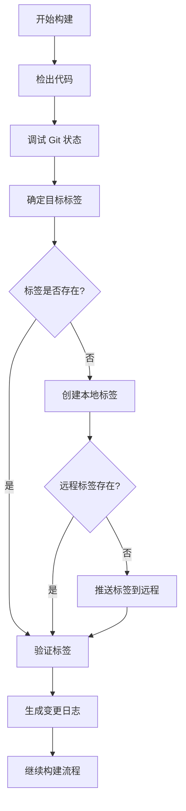

# Build Workflow 自动标签创建功能

## 概述

为了解决 GitHub Actions 构建过程中因版本标签不匹配导致的 Git 失败问题，我们在 `build.yml` 工作流中添加了自动标签创建和验证功能。

## 问题背景

### 原始问题
- **症状**: 所有平台构建失败，Git 进程退出码为 1
- **根本原因**: `package.json` 版本 (1.8.5) 与现有标签 (v1.8.3) 不匹配
- **影响**: 无法正常构建和发布应用程序

### 错误信息
```
build (macos-latest, x86_64-apple-darwin, macOS-Intel, x86_64-apple-darwin)
The process '/opt/homebrew/bin/git' failed with exit code 1
```

## 解决方案

### 1. 自动标签创建逻辑

在 `generate-changelog` 作业中添加了以下步骤：

#### a) Git 状态调试
```yaml
- name: Debug Git state
  run: |
    echo "=== Git Debug Information ==="
    echo "Current branch: $(git branch --show-current)"
    echo "Current commit: $(git rev-parse HEAD)"
    echo "Available tags:"
    git tag -l | head -10
    echo "Package.json version: $(node -p "require('./package.json').version")"
    echo "Remote URL: $(git remote get-url origin)"
```

#### b) 智能标签创建
```yaml
- name: Create and push tag if not exists
  run: |
    TAG="${{ steps.tag.outputs.tag }}"
    
    # Check if tag already exists locally
    if git rev-parse "$TAG" >/dev/null 2>&1; then
      echo "Tag $TAG already exists locally"
    else
      echo "Creating new tag: $TAG"
      git tag "$TAG"
    fi
    
    # Check if tag exists on remote
    if git ls-remote --tags origin | grep -q "refs/tags/$TAG$"; then
      echo "Tag $TAG already exists on remote"
    else
      echo "Pushing tag $TAG to remote"
      git push origin "$TAG"
    fi
```

#### c) 标签验证
```yaml
- name: Verify tag exists
  run: |
    TAG="${{ steps.tag.outputs.tag }}"
    if ! git rev-parse "$TAG" >/dev/null 2>&1; then
      echo "Error: Tag $TAG does not exist after creation attempt"
      echo "Available tags:"
      git tag -l | head -10
      exit 1
    fi
    echo "✅ Tag $TAG verified successfully"
```

### 2. 改进的变更日志生成

增强了错误处理能力：

```yaml
- name: Generate changelog
  id: changelog
  run: |
    # Get the previous tag with improved error handling
    PREVIOUS_TAG=$(git describe --tags --abbrev=0 HEAD^ 2>/dev/null || git describe --tags --abbrev=0 2>/dev/null || echo "")
```

## 功能特性

### ✅ 自动化特性
- **智能标签检测**: 自动检查本地和远程标签是否存在
- **版本同步**: 基于 `package.json` 自动创建对应版本标签
- **幂等操作**: 重复运行不会创建重复标签
- **错误恢复**: 改进的错误处理和回退机制

### ✅ 安全特性
- **非破坏性**: 不会覆盖现有标签
- **验证机制**: 创建后验证标签是否成功
- **调试信息**: 提供详细的 Git 状态信息

### ✅ 兼容性
- **向后兼容**: 保持原有工作流逻辑不变
- **多触发方式**: 支持标签推送、手动触发等多种方式
- **跨平台**: 在所有构建平台上一致工作

## 工作流程



## 使用方法

### 自动触发 (推荐)
当 `package.json` 版本更新后，工作流会自动：
1. 检测版本变化
2. 创建对应的版本标签
3. 推送到远程仓库
4. 开始构建流程

### 手动触发
```bash
# 在 GitHub Actions 页面使用 workflow_dispatch
# 或通过 GitHub CLI
gh workflow run build.yml
```

### 指定版本构建
```bash
# 手动触发时指定特定标签
gh workflow run build.yml -f tag=v1.8.6
```

## 监控和调试

### 查看构建日志
1. 访问 GitHub Actions 页面
2. 查看 "Debug Git state" 步骤输出
3. 检查标签创建和验证步骤

### 常见问题排查

#### 问题: 标签创建失败
**解决方案**: 检查仓库权限和 GITHUB_TOKEN 配置

#### 问题: 推送标签失败
**解决方案**: 确保工作流有 `contents: write` 权限

#### 问题: 版本不匹配
**解决方案**: 更新 `package.json` 版本号后重新运行工作流

## 最佳实践

### 版本管理
1. **语义化版本**: 使用 `x.y.z` 格式
2. **版本同步**: 确保 `package.json` 版本与发布版本一致
3. **标签规范**: 使用 `v` 前缀 (如 `v1.8.5`)

### 发布流程
1. 更新 `package.json` 版本
2. 提交代码变更
3. 工作流自动创建标签并构建
4. 审查并发布草稿 Release

## 技术细节

### 权限要求
```yaml
permissions:
  contents: write  # 用于创建标签和 Release
```

### 环境变量
- `GITHUB_TOKEN`: 自动提供的仓库访问令牌
- `TELEGRAM_BOT_TOKEN`: Telegram 通知 (可选)
- `TELEGRAM_CHAT_ID`: Telegram 聊天 ID (可选)

### 依赖项
- Node.js LTS
- Git 2.x+
- GitHub Actions 环境

## 更新历史

- **v1.0** (2026-02-07): 初始版本，添加自动标签创建功能
- 解决了版本不匹配导致的构建失败问题
- 添加了完整的错误处理和验证机制
- 提供了详细的调试信息

---

**注意**: 此功能已在 commit `717fb53` 中实现并推送到主分支。
